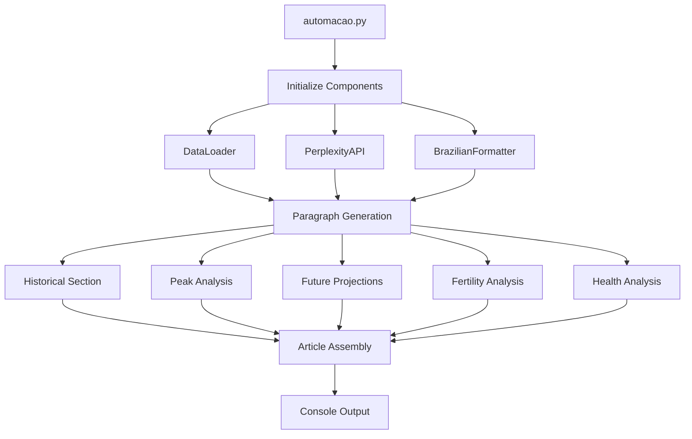

# System Patterns

## Architecture Overview

### Project Structure
```
blog-automatcao/
├── setup.py               # Package installation configuration
├── automacao.py          # Main execution entry point
├── .env                  # Environment variables
├── memory-bank/          # Project documentation
└── src/
    ├── __init__.py
    ├── data/             # Data handling
    │   ├── __init__.py
    │   └── loader.py     # DataLoader class
    ├── utils/            # Utility classes
    │   ├── __init__.py
    │   ├── api.py        # PerplexityAPI client
    │   ├── formatting.py # BrazilianFormatter
    │   └── text_utils.py # Text helpers
    └── paragraphs/       # Article generation
        ├── __init__.py
        ├── growth.py           # Population growth
        ├── ranking.py          # Growth ranking
        ├── creation.py         # State creation
        ├── historical.py       # Historical context
        ├── peak_growth.py      # Peak growth period
        ├── peak_comparison.py  # Growth comparison
        ├── chart_intro.py      # Chart introduction
        ├── graph_image.py      # Population graph
        ├── future_header.py    # Future section
        ├── population_peak.py  # Population peak
        ├── projection_graph.py # Future projection
        ├── graph_description.py # Graph description
        ├── population_peak_comparison.py # Peak comparison
        ├── fertility_rate.py   # Fertility impact
        ├── fertility_graph.py  # Children graph intro
        ├── fertility_graph_image.py # Children graph
        ├── saude_header.py     # Health section header
        ├── saude_infra.py      # Health infrastructure
        ├── saude_cronicos.py   # Chronic conditions
        └── saude_atual.py      # Current health status
```

### Core Components

1. Main Orchestration (automacao.py)
   - Initializes core components
   - Manages article generation flow
   - Coordinates paragraph generation
   - Handles output formatting
   - Manages environment variables

2. Data Layer (src/data/)
   - DataLoader class with:
     * CSV file loading and parsing
     * State code to name mapping
     * Census data extraction
     * Growth calculations
     * Ranking determinations

3. Utils Layer (src/utils/)
   - PerplexityAPI (api.py)
     * API client initialization
     * Error handling
     * Response formatting and cleaning
     * Rate limiting consideration
     * Source formatting standardization
     * Multi-stage fallbacks
   - BrazilianFormatter (formatting.py)
     * Number formatting (locale-aware)
     * Percentage formatting
     * Population value formatting
     * Year range formatting
   - Text Utilities (text_utils.py)
     * Ranking descriptions
     * Creation descriptions
     * Historical formatting
     * Common text patterns
     * Reference cleanup

4. Paragraph Generation (src/paragraphs/)
   - Historical paragraphs:
     * Growth trends
     * Rankings and comparisons 
     * State creation context
     * Historical events
   - Peak analysis:
     * Growth peak periods
     * Growth comparisons
     * Population peaks
     * Regional comparisons
   - Graph sections:
     * Graph introductions
     * Image embedding
     * Graph descriptions
   - Future projections:
     * Population peaks
     * Regional timing
     * Fertility impacts
     * Children demographics
   - Health analysis:
     * Current system status
     * Infrastructure details
     * Chronic care needs
     * Aging population focus

## Design Patterns

### Class-Based Organization
- DataLoader: Encapsulates data access
- PerplexityAPI: Manages API interactions with fallbacks
- BrazilianFormatter: Handles formatting logic
- Consistent initialization patterns
- Clear responsibilities per class

### Function & Method Organization
```python
def generate_xyz_paragraph(data_loader, api_client=None, state_code: str = 'AC') -> str:
    """Standard paragraph generator signature.
    
    Args:
        data_loader: DataLoader instance
        api_client: Optional PerplexityAPI instance for external data
        state_code: Two-letter state code
        
    Returns:
        Formatted paragraph text
    """
```

### Error Handling Pattern
```python
try:
    # Attempt data access/transformation
    if not valid_condition:
        return None  # Soft failure
    
    # Try primary approach
    result = primary_method()
    if not result:
        # Fallback to alternative
        result = fallback_method()
        
except Exception as e:
    print(f"Error context: {e}")
    return fallback_content  # Graceful degradation
```

### Data Flow Pattern


## Component Relationships

### Data Access Chain
1. DataLoader loads and validates CSV data
2. Paragraph generators request data through DataLoader
3. Data transformations handled by utility classes
4. API responses cleaned and standardized
5. Results formatted according to Brazilian standards

### Content Generation Chain
1. automacao.py initializes components with environment variables
2. Each paragraph generator:
   - Gets data from DataLoader
   - Uses PerplexityAPI if needed (with fallbacks)
   - Formats with BrazilianFormatter
   - Returns formatted text
3. Main script assembles content in sequence:
   - Historical context first
   - Current analysis
   - Future projections
   - Fertility impact
   - Health system analysis last

## Error Handling Strategy
- Data validation at input
- Multi-stage fallback system
- Source format standardization
- Graceful degradation when possible
- Clear error messages
- Consistent error patterns
- Type hints for prevention
- Null safety checks
- Generic content fallbacks
