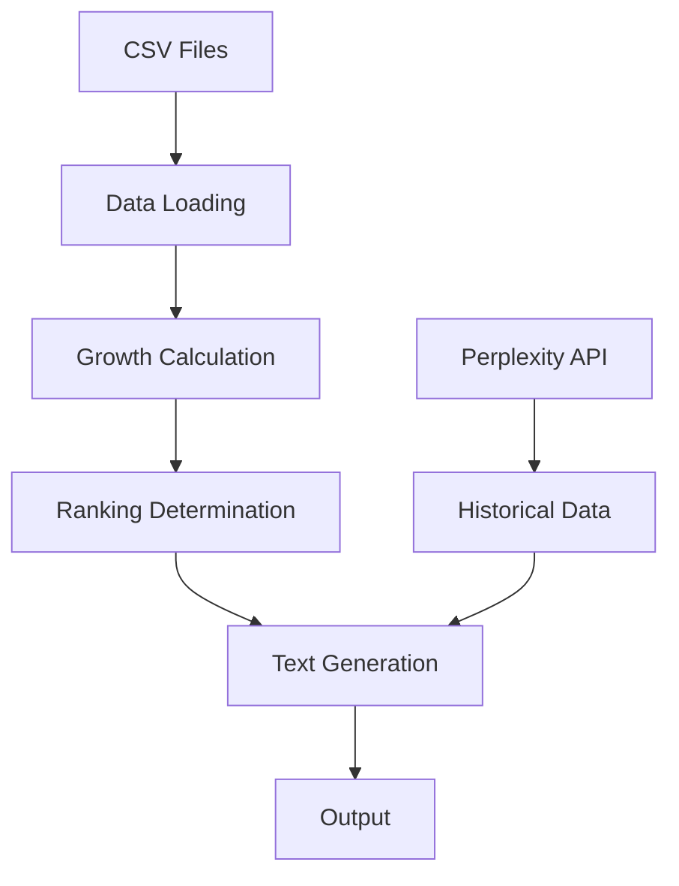

# System Patterns

## Architecture Overview

### Project Structure
```
blog-automatcao/
├── setup.py               # Package installation configuration
└── src/
    ├── __init__.py
    ├── main.py           # Main orchestration
    ├── data/             # Data handling
    │   ├── __init__.py
    │   └── loader.py     # CSV processing
    ├── utils/            # Utility functions
    │   ├── __init__.py
    │   ├── api.py        # API integration
    │   ├── formatting.py # Text formatting
    │   └── text_utils.py # Text helpers
    └── paragraphs/       # Article generation
        ├── __init__.py
        ├── growth.py     # Population growth
        ├── ranking.py    # Growth ranking
        ├── creation.py   # State creation
        └── historical.py # Historical context
```

### Core Components

1. Data Layer (src/data/)
   - Centralizes CSV file operations
   - Handles data filtering and queries
   - Manages state-specific data access

2. Utils Layer (src/utils/)
   - API Integration (api.py)
     - State creation date retrieval
     - Historical information retrieval
   - Text Formatting (formatting.py)
     - Brazilian number formatting
     - Source citation handling
   - Text Helpers (text_utils.py)
     - Portuguese text conversions
     - Position formatting

3. Paragraph Generation (src/paragraphs/)
   - Independent modules per paragraph type
   - Consistent interface across generators
   - Focused responsibility per module

4. Main Orchestration (src/main.py)
   - Coordinates data flow
   - Manages paragraph assembly
   - Handles final output

## Design Patterns

### Module Organization
- Package-based structure
- Clear separation of concerns
- Independent module testing capability
- Consistent import patterns

### Functions & Responsibilities

1. `format_number(num)`
   - Handles number formatting according to Brazilian standards
   - Includes fallback mechanism for locale issues

2. `format_historical_info(content)`
   - Cleans and formats historical information
   - Handles source citations
   - Removes extra spaces and normalizes text

3. `get_state_creation_date()`
   - Manages API call for state creation info
   - Uses system prompt for precise responses
   - Implements error handling

4. `get_historical_info(year)`
   - Retrieves historical context via API
   - Formats response in Portuguese
   - Ensures consistent sentence structure

### Data Flow Pattern



## Component Relationships

### Data Processing Chain
1. Load CSV data for state information
2. Calculate growth metrics
3. Determine rankings (national and regional)
4. Format numerical data

### Content Generation Chain
1. Retrieve historical data from API
2. Format and clean responses
3. Combine with statistical data
4. Generate structured paragraphs

## Error Handling Strategy
- API request failures: Graceful degradation
- Locale formatting issues: Fallback mechanism
- Data validation: Null/empty checks
- Exception logging: Print statements for debugging
